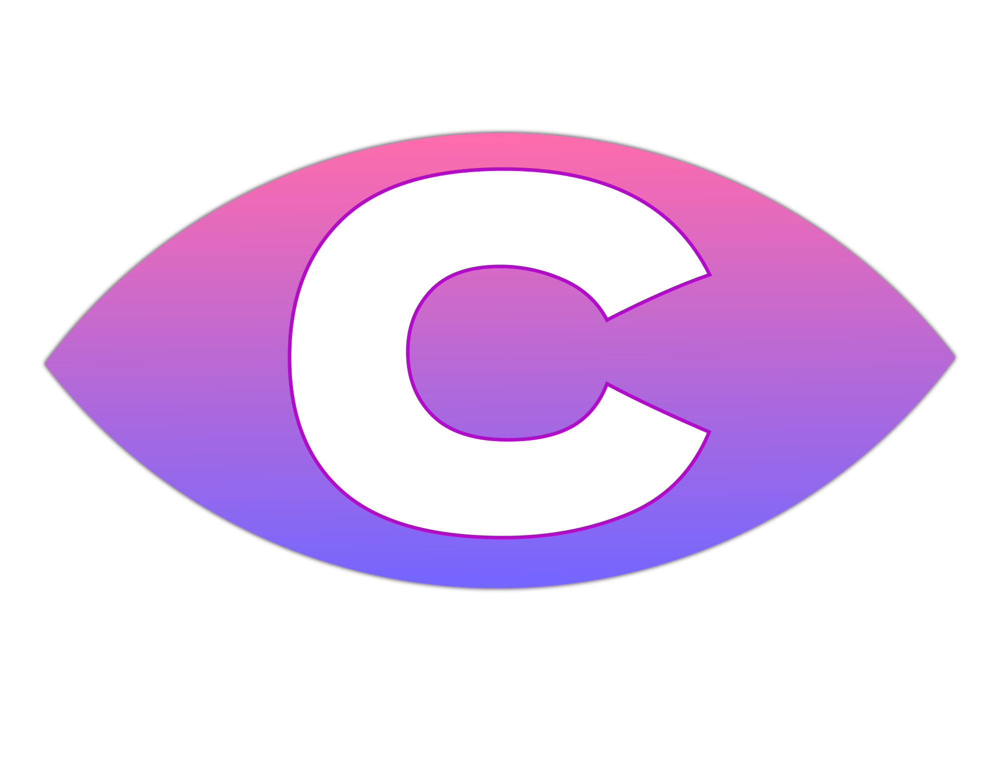
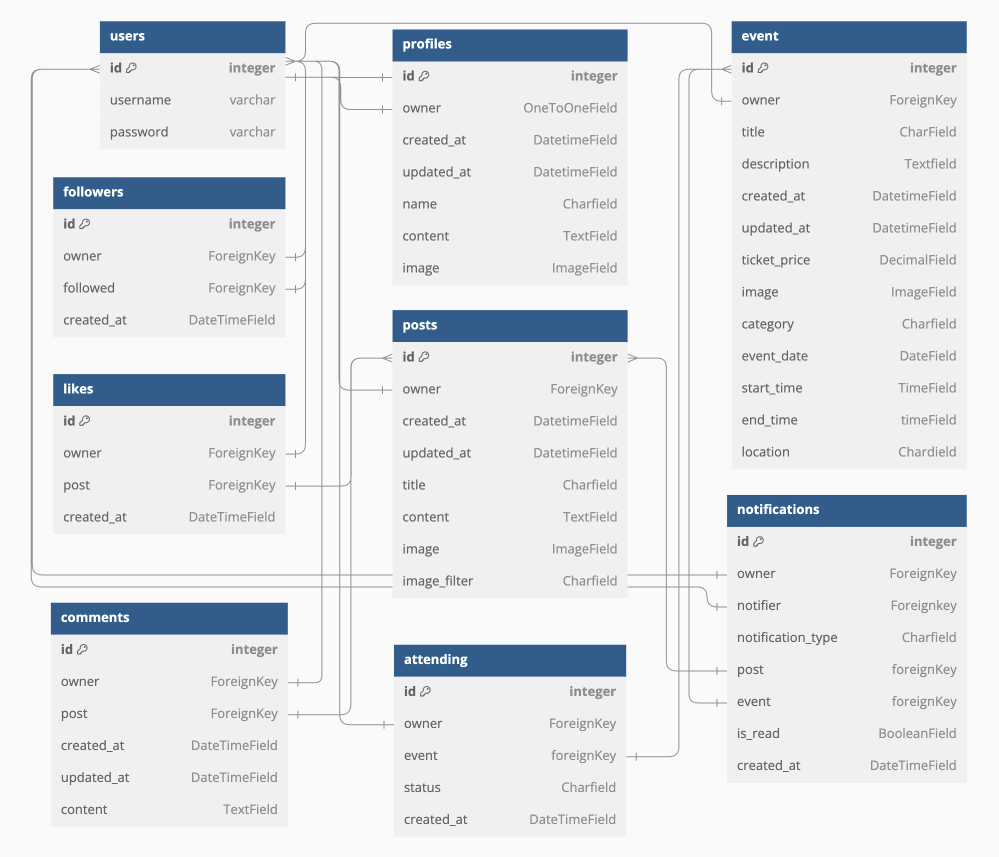

  

<h1 align="center">Chronicle</h1>

<h2>Welcome</h2>

Link to live website: [CLICK HERE!](https://chronicle-ci-fad840fb8771.herokuapp.com/)

(**Responsive Image**)

[Chronicle Django Rest Framework API Backend Live Link](https://chronicle-api-8dba6c70f37d.herokuapp.com/)
[Chronicle Backend Github Repo](https://github.com/Ahmadk-g/chronicle-api)

# Introduction

Welcome to Chronicle, a vibrant social platform where connections come to life! Chronicle is designed to bring people together through shared stories, engaging posts, and memorable events. Whether you’re here to connect with others, showcase your experiences, or discover inspiring content, Chronicle is your go-to destination for meaningful social engagement.

<h3>What You Can Do</h3>

**With Chronicle, you can:**

- Share your stories through posts and media.
- Discover and join exciting events in your community.
- Interact with others through likes, comments, and follows.
- Stay updated with real-time notifications for all your activities.
- Manage your profile and personalize your Chronicle experience.

Our frontend is built using React to ensure a sleek and responsive interface that provides users with an intuitive and enjoyable experience. It seamlessly integrates with a powerful Django backend, enabling robust and reliable functionality.

<h3>Join the Chronicle Community</h3>
Dive into Chronicle today and become part of a thriving community! Whether you're here to create, connect, or simply explore, Chronicle has something for everyone. Share your voice, engage with others, and be inspired. Together, let’s make every moment count.

 

# UX - User Experience

Chronicle is designed to provide an intuitive, engaging, and inclusive experience for users who want to connect, share, and explore. Our platform prioritizes seamless interaction, personalization, and accessibility, ensuring a delightful journey for all. Here's how Chronicle delivers an exceptional user experience:

- **Intuitive Navigation:**
With a clean and organized interface, Chronicle makes it easy for users to explore posts, events, and profiles. Our straightforward navigation ensures that everything you need is just a few clicks away.

- **Responsive Design:**
Chronicle is optimized for desktops, tablets, and mobile devices, ensuring a smooth and consistent experience across all platforms. Whether you're browsing on the go or at home, the platform adapts perfectly to your screen size.

- **Personalization:**
Users can manage their profiles, save their favorite content, and curate their experience by following users and interacting with posts. Chronicle tailors itself to your unique preferences, making every visit meaningful.

- **Engaging Interactions:**
Chronicle fosters connections through features like likes, comments, follows, and event RSVPs. These interactive elements create a vibrant and dynamic community where everyone can participate and engage.

- **Real-Time Notifications:**
Stay up-to-date with real-time notifications about your posts, events, followers, and more, ensuring that you never miss an important moment.

- **Event-Centric Features:**
Chronicle’s events feature allows users to discover, RSVP to, and engage with events effortlessly. Whether you're organizing or attending, events are seamlessly integrated into the user experience.

Chronicle’s UX is crafted to empower users to connect, share, and explore in a supportive and accessible environment. With its thoughtful design and engaging features, Chronicle ensures every user feels at home in its thriving community.

 

# Design

## Color Scheme

.
.
.

## Fonts

.
.
.

 

# Project Planning

## Scope Plane

### Purpose and Goal
Chronicle is a modern social media platform designed to bring communities closer by enabling users to share posts, create events, and interact seamlessly with others. It empowers users to connect, engage, and stay updated on topics and activities that matter most to them. The goal is to provide a vibrant, inclusive, and interactive digital space that fosters meaningful connections, creativity, and collaboration.

### Target Audience
- **Social Enthusiasts**: Individuals who enjoy sharing posts, following trends, and staying connected with friends and communities.
- **Event Organizers**: Users looking for a platform to promote, manage, and engage attendees for events.
- **Content Creators**: Those who wish to share creative content and interact with a wide audience.
- **Community Builders**: Users passionate about fostering relationships and engaging with like-minded individuals.

### User Needs
- Effortless sharing of posts and events to express ideas and creativity.
- Reliable notifications to stay informed about interactions and upcoming activities.
- User-friendly tools to discover and RSVP to events.
- A personalized experience through customizable profiles and tailored content.
- A seamless way to engage with posts, events, and other users via likes, comments, and follows.
- An intuitive and responsive interface accessible on all devices.

### Features
- **Post Sharing**: Create, edit, and delete posts with text, images, or media attachments.
- **Engagement Tools**: Interact with content through likes, comments, and follows.
- **Event Management**: Create, RSVP to, and manage events.
- **Notification System**: Real-time updates on interactions, followers, and events.
- **Search and Discovery**: Advanced search functionality to find users, posts, and events.
- **Profile Customization**: Manage profile details and view personalized activity feeds.
- **Responsive Design**: A seamless experience across desktops, tablets, and mobile devices.
- **Authentication Features**: Secure sign-up, sign-in, and refreshable access tokens.

## Agile Methodologies

.
.
.

## Structural Plane

### Information Architecture

1. **Navigation**

    - **Primary Navigation:** Links to the Home page and Events page
        - **Registered Users:** Links to the posts feed page, liked posts page, Notifications page, Profile page, and Sign-out
        - **Unregistered Users:** Links to Sign-in/Sign-up pages

2. **Home Page**

    - Overview of the platform
    - NavBar with links to essential pages
    - List of posts displayed in reverse chronological order (most recent first)
    - Search bar for finding posts
    - Most popular profiles container

3. **Post Feed**
    - Displays posts from users you follow

4. **Liked Posts**
    - Displays posts you’ve liked

5. **Events Page**
    - Display list of events
    - Link to individual event pages

6. **Detailed Pages of Posts or Events**
    - Show all post/event details
    - Allow user interaction:
        - **For posts:** Liking/unliking and commenting
        - **For events:** Marking attendance

7. **User Profile Page**
    - Profile customization and editing options
    - Display of user’s posts, events, followers, and following

8. **User Authentication**
    - **Login Page:** Secure login form
    - **Registration Page:** User registration form

9. **Social Interactions**
    - Interacting with posts and events through comments, likes, and RSVPs
    - Interacting with users by following and unfollowing
    - Receiving notifications for user interactions

10. **Notifications**
    - Display notifications for user activity
    - Links to the relevant user, post, or event

11. **Search Functionality**
    - Global search bar for posts and events

## Skeleton & Surface Planes

### WireFrames

.
.
.

##  Database Schema - Entity relationship Diagram

### **Entity Relationship Diagram (ERD**)
The ERD visually maps out the relationships and dependencies among various entities in the system. It provides a clear representation of how users interact with posts, events, and other users, while also highlighting the notification and social engagement processes. This diagram acts as a blueprint for developers, making it easier to understand the data flow and identify key relationships within the application. 

[dbdiagram.io](https://dbdiagram.io) was utilized to design the ERD.

### **Key Model Relationships**

- Users:
  - **Profile**: Extends the default Django User model with additional fields for personalization.
  - **Followers**: Creates a many-to-many relationship, enabling users to follow and unfollow one another, fostering a social network.

- Posts:
  - **User-generated content**: Posts include text, images, and multimedia to encourage user engagement.
  - **Likes and Comments**: Linked to Likes and Comments for user interaction with posts, enabling likes and threaded discussions.
  - **Notifications**: Post interactions trigger notifications, keeping users updated on likes, comments, and more.
  - **Timestamps**: Tracks creation and update times, ensuring content freshness.

- Followers
  - **User Connections**: Manages who follows whom by using two ForeignKey fields, creating a many-to-many relationship between users.
  - **Notifications**: Following users triggers notifications, alerting new followers and activity.
  - **Dynamic Relationship**: Users can follow and unfollow at any time, with real-time updates.

- Notifications:
  - **Event-Driven**: Triggered by user actions (likes, comments, follows, event participation) to keep users informed.
  - **Notification Types**: Flexible notification_type field allows new notification types to be added easily.
  - **User-Centric**: Notifications are linked to users, ensuring personalized updates.

- Events:
  - **User-Generated**: Users create events for social gatherings, online meetups, etc.
  - **RSVP & Status**: Tracks participation with statuses like "interested" or "attending" via the Attending model.
  - **Notifications**: Event updates trigger notifications to participants and hosts.
  - **Timestamps**: Events have start and end times to track scheduling.

- Interactions
  - **Likes, Comments & Attendings**: Users interact with posts and events through likes, comments, and attending statuses.
  - **Nested Comments**: Supports threaded comments for deeper discussions.
  - **Dynamic Updates**: Interactions update in real-time, with notifications for new likes, comments, followers or event RSVP's.

 

### **Entity Relationships Overview:**
- **One-to-One:** Each user profile is uniquely tied to a Django User model instance.
- **One-to-Many:** 
  - Users can create multiple posts, comments, likes, or events.
  - Posts can have multiple comments and likes.
- **Many-to-Many:**
  - Follower relationships enable users to connect with each other.
  - Event attendance is facilitated through intermediary models.

   

<u>Comprehnsive Relationship Table</u>

| Primary Model |  Related Model | Relationship Type | Description |
|---------|---------|----------|------------------|
| User | Profile | One-to-One | Each user has one profile. |
| User | Post | One-to-Many | One user can create multiple posts. |
| User | Event | One-to-Many | One user can create multiple events. |
| User | Comment | One-to-Many | One user can create multiple comments. |
| User | Like | One-to-Many | One user can like many posts. |
| User | Attendings | One-to-Many | One user can attend multiple Events. |
| User | Follower | Many-to-Many | Users can follow each other. |
| Post | Like | One-to-Many | A post can have many likes. |
| Post | Comment | One-to-Many | A post can have many comments. |
| Event | Attendings | Many-to-Many | Events can have multiple participants. |
| Notification | User | Many-to-One | Many Notifications belong to one users |
| Notification | Post | Many-to-One | Many Notifications belong can be associated with one post |
| Notification | Events | Many-to-One | Many Notifications belong can be associated with one event |

 

## Security
Security is essential for protecting user data and platform integrity.

- **Data Encryption**: Sensitive data, including passwords and personal information, is encrypted to prevent unauthorized access.
- **CSRF Tokens**: Each form submission includes a CSRF token to guard against cross-site request forgery attacks.
- **Authentication**: User authentication is managed by Django AllAuth, ensuring secure user registration and login.
- **API Security**: The API is protected with token-based authentication, limiting actions like creating posts or updating profiles to authenticated users. Superuser permissions are required for admin actions.

This ensures a secure experience for all users on the platform.

# Features
.
.
,

