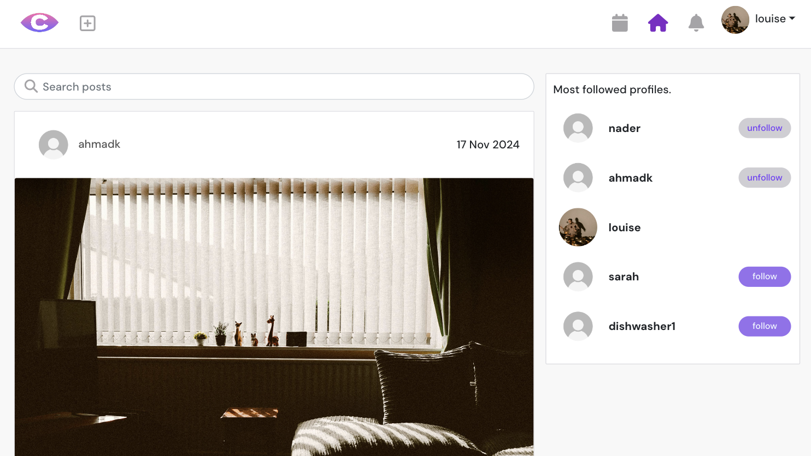
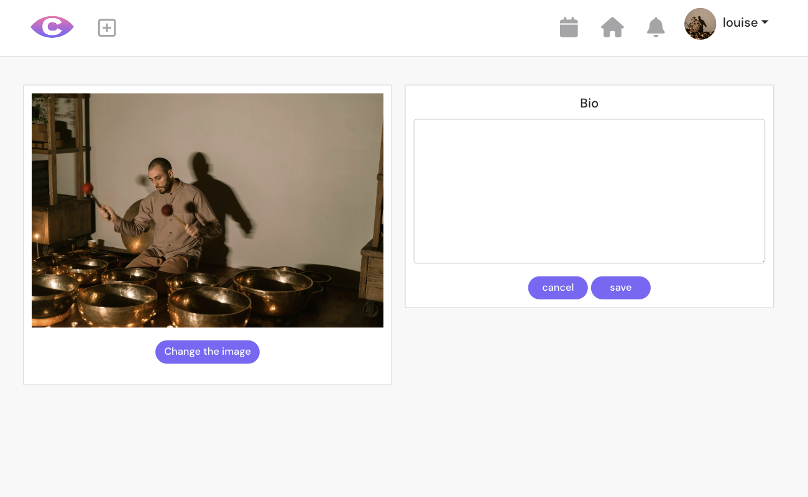
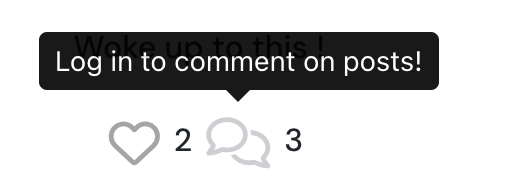

  

<h1 align="center">Chronicle</h1>

<h2>Welcome</h2>

Link to live website: [CLICK HERE!](https://chronicle-ci-fad840fb8771.herokuapp.com/)

(**Responsive Image**)

[Chronicle Django Rest Framework API Backend Live Link](https://chronicle-api-8dba6c70f37d.herokuapp.com/)
[Chronicle Backend Github Repo](https://github.com/Ahmadk-g/chronicle-api)

# Introduction

Welcome to Chronicle, a vibrant social platform where connections come to life! Chronicle is designed to bring people together through shared stories, engaging posts, and memorable events. Whether you’re here to connect with others, showcase your experiences, or discover inspiring content, Chronicle is your go-to destination for meaningful social engagement.

<h3>What You Can Do</h3>

**With Chronicle, you can:**

- Share your stories through posts and media.
- Discover and join exciting events in your community.
- Interact with others through likes, comments, and follows.
- Stay updated with real-time notifications for all your activities.
- Manage your profile and personalize your Chronicle experience.

Our frontend is built using React to ensure a sleek and responsive interface that provides users with an intuitive and enjoyable experience. It seamlessly integrates with a powerful Django backend, enabling robust and reliable functionality.

<h3>Join the Chronicle Community</h3>
Dive into Chronicle today and become part of a thriving community! Whether you're here to create, connect, or simply explore, Chronicle has something for everyone. Share your voice, engage with others, and be inspired. Together, let’s make every moment count.

 

# UX - User Experience

Chronicle is designed to provide an intuitive, engaging, and inclusive experience for users who want to connect, share, and explore. Our platform prioritizes seamless interaction, personalization, and accessibility, ensuring a delightful journey for all. Here's how Chronicle delivers an exceptional user experience:

- **Intuitive Navigation:**
With a clean and organized interface, Chronicle makes it easy for users to explore posts, events, and profiles. Our straightforward navigation ensures that everything you need is just a few clicks away.

- **Responsive Design:**
Chronicle is optimized for desktops, tablets, and mobile devices, ensuring a smooth and consistent experience across all platforms. Whether you're browsing on the go or at home, the platform adapts perfectly to your screen size.

- **Personalization:**
Users can manage their profiles, save their favorite content, and curate their experience by following users and interacting with posts. Chronicle tailors itself to your unique preferences, making every visit meaningful.

- **Engaging Interactions:**
Chronicle fosters connections through features like likes, comments, follows, and event RSVPs. These interactive elements create a vibrant and dynamic community where everyone can participate and engage.

- **Real-Time Notifications:**
Stay up-to-date with real-time notifications about your posts, events, followers, and more, ensuring that you never miss an important moment.

- **Event-Centric Features:**
Chronicle’s events feature allows users to discover, RSVP to, and engage with events effortlessly. Whether you're organizing or attending, events are seamlessly integrated into the user experience.

Chronicle’s UX is crafted to empower users to connect, share, and explore in a supportive and accessible environment. With its thoughtful design and engaging features, Chronicle ensures every user feels at home in its thriving community.

 

# Design

## Color Scheme

The color palette used across the site is inspired by the vibrant tones of our logo, creating a visually cohesive and engaging experience. To enhance usability and guide user interaction, different shades of these core colors are applied strategically throughout the app. From subtle background hues to dynamic hover effects, each color and shade is chosen to complement the design and improve user experience based on context and functionality. 

Below is a breakdown of the primary colors and their contextual usage:

**Primary Colors**
- **Main Background** `#f8f8f8`: Used as the primary background color across the app for a clean and neutral base.
- **Content Background** `#ffffff`: Applied to cards, containers, and main content areas to maintain a bright and focused look.

**Intercative Elements**
- **Navbar Icons**: Default `#a5a4a7`, Hover `#ff76f4`, Active `#802ac7`
- **Buttons**: 
  - Primary: `#76bbfa`
  - Following: `#9671ee`
  - Comment Post: Default `#9671ee`, Hover `#cfced3`
  - Event Attending: Default `#000`, Hover `#ff76f4`, Active `#a02ac7`

Text colors are also dynamically adjusted to ensure strong contrast and optimal readability across various backgrounds. This thoughtful approach ensures a harmonious and accessible interface, while maintaining consistency with the brand's identity.

## Fonts

The primary font used throughout the site is **DM Sans**, which provides a clean and modern look, enhancing readability and aesthetics. 

To ensure consistency, **sans-serif** is designated as a backup font, serving as a fallback in cases where the primary font fails to load correctly.

 

# Project Planning

## Scope Plane

### Purpose and Goal
Chronicle is a modern social media platform designed to bring communities closer by enabling users to share posts, create events, and interact seamlessly with others. It empowers users to connect, engage, and stay updated on topics and activities that matter most to them. The goal is to provide a vibrant, inclusive, and interactive digital space that fosters meaningful connections, creativity, and collaboration.

### Target Audience
- **Social Enthusiasts**: Individuals who enjoy sharing posts, following trends, and staying connected with friends and communities.
- **Event Organizers**: Users looking for a platform to promote, manage, and engage attendees for events.
- **Content Creators**: Those who wish to share creative content and interact with a wide audience.
- **Community Builders**: Users passionate about fostering relationships and engaging with like-minded individuals.

### User Needs
- Effortless sharing of posts and events to express ideas and creativity.
- Reliable notifications to stay informed about interactions and upcoming activities.
- User-friendly tools to discover and RSVP to events.
- A personalized experience through customizable profiles and tailored content.
- A seamless way to engage with posts, events, and other users via likes, comments, and follows.
- An intuitive and responsive interface accessible on all devices.

### Features
- **Post Sharing**: Create, edit, and delete posts with text, images, or media attachments.
- **Engagement Tools**: Interact with content through likes, comments, and follows.
- **Event Management**: Create, RSVP to, and manage events.
- **Notification System**: Real-time updates on interactions, followers, and events.
- **Search and Discovery**: Advanced search functionality to find users, posts, and events.
- **Profile Customization**: Manage profile details and view personalized activity feeds.
- **Responsive Design**: A seamless experience across desktops, tablets, and mobile devices.
- **Authentication Features**: Secure sign-up, sign-in, and refreshable access tokens.

## Agile Methodologies

Chronicle was developed using Agile methodology, fostering iterative development and adaptability throughout the project. The use of GitHub Projects and Issues allowed for efficient task management via a Kanban-style board. This approach facilitated the organization of tasks into Epics, User Stories, and actionable Tasks, ensuring continuous progress tracking and a user-focused final product.

### Epics and User Stories

- **Epics**: Represent large features or overarching objectives, broken down into smaller, actionable components to enable a structured and manageable development process.

- **User Stories**: Define specific functionalities or features from a user's perspective, with clear acceptance criteria to ensure completeness. Each user story often comprises several tasks that need to be completed to meet the user’s needs.

You can explore the project's epics and user stories on the [GitHub Kanban Board](https://github.com/users/Ahmadk-g/projects/5).

### MoSCoW Prioritization

To manage priorities and allocate resources effectively, the MoSCoW method was used, categorizing tasks as follows:

- **Must Have**: Essential features that are critical for the app’s core functionality.
- **Should Have**: Important features that enhance user experience but are not immediately critical.
- **Could Have**: Desirable features addressed only after "Must Have" and "Should Have" requirements are completed.
- **Won’t Have**: Features not considered for the initial release but potentially included in future updates.

### Kanban Board
A Kanban board was utilized for visualizing the workflow, tracking the status of user stories, and ensuring efficient task management. The board highlights tasks in various stages: To Do, In Progress, and Completed, promoting transparency and streamlined development.

You can view the project's Kanban board [here](https://github.com/users/Ahmadk-g/projects/5).

Below is an outline of the Epics and their respective User Stories implemented in the project:

#### Epic 1: Authentication and User management
User account creation, login/logout processes, profile personalization, and secure token-based session management.

**User Stories**
| Title | User Story | MoSCoW Priority |
|---------|----------------------|------------------------------|
| Authentication - Sign up | As a user, I can create a new account so that I can access all the features available to registered users. | MUST HAVE |
| Authentication - Sign in and Logged-In Status | As a user, I can sign in to the app and know whether I am logged in or not so that I can acess functionality for logged-in users. | MUST HAVE |
| Authentication - Refreshing Access Tokens    | As a user, I can maintain a Logged-in status until I choose to log out so that my user experience is not compromised. | SHOULD HAVE |
| Profile Management | As a user, I can create and update my profile details and profile picture so that others can learn more about me. | SHOULD HAVE |
| View User Profiles     | As a user, I can view other user profiles so that I can learn about their interests and activities. | SHOULD HAVE |

#### Epic 2: Navigation and Content Discovery
Enabling users to seamlessly navigate the platform and discover content through menus, search functionality, and curated feeds.

**User Stories**
| Title | User Story | MoSCoW Priority |
|---------|----------------------|------------------------------|
| Navigation | As a user, I can view a navbar from every page so that I can navigate easily between pages. | MUST HAVE |
| Search Content | As a user, I can search for posts, events, or profiles by keyword so that I can easily discover. | SHOULD HAVE |
| View List of Posts | As a user I can view all posts, ordered by most recently created first so that I am up to date with the newest content. | MUST HAVE |
| View a Post | As a user, I can view the details of a single post so that I can learn more about it and comment on it. | Must HAVE |
| View Liked Posts | As a logged-in user I can view the posts I have liked so that I can revisit and engage with the content I enjoy the most. | SHOULD HAVE |
| View Posts of Followed Users | As a logged-in user I can view posts created by users I follow so that I can keep up with their latest updates and activity. | SHOULD HAVE |
| View List of Events | As a user I can view all events so that I can stay informed about upcoming activities. | MUST HAVE |

#### Epic 3: Posts and Engagement
Creating, editing, and deleting posts, as well as interacting with them through likes, comments, and threaded discussions.

**User Stories**
| Title | User Story | MoSCoW Priority |
|---------|----------------------|------------------------------|
| Create a Post | As a user, I can create a post so that I can share experiences and interests. | MUST HAVE |
| Edit and Delete Post | As a user, I can edit and delete my posts so that I keep my content accurate. | SHOULD HAVE |
| Like and Unlike Posts | As a user, I can like and unlike posts so that I can show appreciation. | MUST HAVE |
| Comment on Posts | As a user, I can comment on posts so that I can engage in discussions. | Must HAVE |
| Edit and Delete Comments | As a user, I can edit and delete my comments so that I can maintain the accuracy of my feedback and remove any comments I no longer want to share. | SHOULD HAVE |

#### Epic 4: Events Management
Creating, managing, and engaging with events, including RSVP functionality and viewing attendee count.

**User Stories**
| Title | User Story | MoSCoW Priority |
|---------|----------------------|------------------------------|
| Create an Event | As a user, I can create events so that others can join. | MUST HAVE |
| Edit and Delete Event | As a user, I can edit and delete my events so that I keep my content accurate. | SHOULD HAVE |
| RSVP to Events | As a user, I can RSVP to an event so that I indicate if I'm attending. | MUST HAVE |

#### Epic 5: Social Interaction and Notifications
Encapsulates user connections (following/unfollowing) and notification systems that keep users informed about relevant interactions and updates.

**User Stories**
| Title | User Story | MoSCoW Priority |
|---------|----------------------|------------------------------|
| Follow Other Users | As a user, I can follow and unfollow other users so that I can stay updated on their content. | MUST HAVE |
| Follower Notifications | As a user, I can be notified when someone new follows me so that I am aware of my profile engagement. | SHOULD HAVE |
| Post and Event Engagement Notifications | As a user, I can recieve notifications so that I am aware of my content engagement. | MUST HAVE |
| Notifications Page | As a logged-in user, I can view all my notifications on a dedicated page so that I can stay updated on interactions related to my posts, follows, and events. | MUST HAVE |

## Structural Plane

### Information Architecture

1. **Navigation**

    - **Primary Navigation:** Links to the Home page and Events page
        - **Registered Users:** Links to the posts feed page, liked posts page, Notifications page, Profile page, and Sign-out
        - **Unregistered Users:** Links to Sign-in/Sign-up pages

2. **Home Page**

    - Overview of the platform
    - NavBar with links to essential pages
    - List of posts displayed in reverse chronological order (most recent first)
    - Search bar for finding posts
    - Most popular profiles container

3. **Post Feed**
    - Displays posts from users you follow

4. **Liked Posts**
    - Displays posts you’ve liked

5. **Events Page**
    - Display list of events
    - Link to individual event pages

6. **Detailed Pages of Posts or Events**
    - Show all post/event details
    - Allow user interaction:
        - **For posts:** Liking/unliking and commenting
        - **For events:** Marking attendance

7. **User Profile Page**
    - Profile customization and editing options
    - Display of user’s posts, events, followers, and following

8. **User Authentication**
    - **Login Page:** Secure login form
    - **Registration Page:** User registration form

9. **Social Interactions**
    - Interacting with posts and events through comments, likes, and RSVPs
    - Interacting with users by following and unfollowing
    - Receiving notifications for user interactions

10. **Notifications**
    - Display notifications for user activity
    - Links to the relevant user, post, or event

11. **Search Functionality**
    - Global search bar for posts and events

## Skeleton & Surface Planes

### WireFrames

I've used [Balsamiq](https://balsamiq.com/wireframes) to design the site wireframes.

**Home Page Wireframes**

Click to View Home Page wireframes

**Desktop**

Click to View Home Page after Login wireframes

**Desktop**

**My Feed, My likes Page Wireframes**

"Click to View User-Specific Post Page Wireframes"

**Desktop**

**Post Detail Page Wireframes**

"Click to View Post Detail Page Wireframes"

**Desktop**

**Events, My Events Page Wireframes**

"Click to View Page Wireframes"

**Desktop**

**Notifications Page Wireframes**

"Click to View Notifications Page Wireframes"

**Desktop**

**Add and Edit Post Page Wireframes**

"Click to View Content create or edit Page Wireframes"

**Desktop**

The Event Creation and Edit pages are similar but with a different form.

**Profile Page Wireframes**

"Click to View Profile Page Wireframes"

**Desktop**

##  Database Schema - Entity relationship Diagram

### **Entity Relationship Diagram (ERD**)
The ERD visually maps out the relationships and dependencies among various entities in the system. It provides a clear representation of how users interact with posts, events, and other users, while also highlighting the notification and social engagement processes. This diagram acts as a blueprint for developers, making it easier to understand the data flow and identify key relationships within the application. 

[dbdiagram.io](https://dbdiagram.io) was utilized to design the ERD.

### **Key Model Relationships**

- Users:
  - **Profile**: Extends the default Django User model with additional fields for personalization.
  - **Followers**: Creates a many-to-many relationship, enabling users to follow and unfollow one another, fostering a social network.

- Posts:
  - **User-generated content**: Posts include text, images, and multimedia to encourage user engagement.
  - **Likes and Comments**: Linked to Likes and Comments for user interaction with posts, enabling likes and threaded discussions.
  - **Notifications**: Post interactions trigger notifications, keeping users updated on likes, comments, and more.
  - **Timestamps**: Tracks creation and update times, ensuring content freshness.

- Followers
  - **User Connections**: Manages who follows whom by using two ForeignKey fields, creating a many-to-many relationship between users.
  - **Notifications**: Following users triggers notifications, alerting new followers and activity.
  - **Dynamic Relationship**: Users can follow and unfollow at any time, with real-time updates.

- Notifications:
  - **Event-Driven**: Triggered by user actions (likes, comments, follows, event participation) to keep users informed.
  - **Notification Types**: Flexible notification_type field allows new notification types to be added easily.
  - **User-Centric**: Notifications are linked to users, ensuring personalized updates.

- Events:
  - **User-Generated**: Users create events for social gatherings, online meetups, etc.
  - **RSVP & Status**: Tracks participation with statuses like "interested" or "attending" via the Attending model.
  - **Notifications**: Event updates trigger notifications to participants and hosts.
  - **Timestamps**: Events have start and end times to track scheduling.

- Interactions
  - **Likes, Comments & Attendings**: Users interact with posts and events through likes, comments, and attending statuses.
  - **Nested Comments**: Supports threaded comments for deeper discussions.
  - **Dynamic Updates**: Interactions update in real-time, with notifications for new likes, comments, followers or event RSVP's.

 

### **Entity Relationships Overview:**
- **One-to-One:** Each user profile is uniquely tied to a Django User model instance.
- **One-to-Many:** 
  - Users can create multiple posts, comments, likes, or events.
  - Posts can have multiple comments and likes.
- **Many-to-Many:**
  - Follower relationships enable users to connect with each other.
  - Event attendance is facilitated through intermediary models.

   

<u>Comprehnsive Relationship Table</u>

| Primary Model |  Related Model | Relationship Type | Description |
|---------|---------|----------|------------------|
| User | Profile | One-to-One | Each user has one profile. |
| User | Post | One-to-Many | One user can create multiple posts. |
| User | Event | One-to-Many | One user can create multiple events. |
| User | Comment | One-to-Many | One user can create multiple comments. |
| User | Like | One-to-Many | One user can like many posts. |
| User | Attendings | One-to-Many | One user can attend multiple Events. |
| User | Follower | Many-to-Many | Users can follow each other. |
| Post | Like | One-to-Many | A post can have many likes. |
| Post | Comment | One-to-Many | A post can have many comments. |
| Event | Attendings | Many-to-Many | Events can have multiple participants. |
| Notification | User | Many-to-One | Many Notifications belong to one users |
| Notification | Post | Many-to-One | Many Notifications belong can be associated with one post |
| Notification | Events | Many-to-One | Many Notifications belong can be associated with one event |

 

## Security
Security is essential for protecting user data and platform integrity.

- **Data Encryption**: Sensitive data, including passwords and personal information, is encrypted to prevent unauthorized access.
- **CSRF Tokens**: Each form submission includes a CSRF token to guard against cross-site request forgery attacks.
- **Authentication**: User authentication is managed by Django AllAuth, ensuring secure user registration and login.
- **API Security**: The API is protected with token-based authentication, limiting actions like creating posts or updating profiles to authenticated users. Superuser permissions are required for admin actions.

This ensures a secure experience for all users on the platform.

# Features

### Logo

The logo is not just a visual element but also a functional feature. Clicking on it will always bring you back to the homepage, providing an easy way to navigate to the starting point of the site.

<strong>Click to View Logo</strong>

### Responsice Navigation Bar

The Chronicle Navbar is designed to provide seamless navigation throughout the platform. It features intuitive icons for core functionalities, with descriptive labels appearing on hover for clarity. For actions like "Sign In" and "Sign Up," visible text is displayed alongside the icons to prioritize accessibility for new users.

The navbar dynamically adapts based on user authentication status.
- For unauthenticated users, options like "Sign In" and "Sign Up" are prominently displayed. 
- Once signed in, the navbar updates to include personalized elements like access to "My Feed" "My likes," and user-specific features, ensuring an efficient and tailored experience.

<strong>Click to View NavBar</strong>

#### Before user login
<!--  -->

#### After user login
<!--  -->

#### Add content dropdown
<!--  -->

#### User-specific Side dropdown
<!--  -->

 

On smaller screens, the navbar compresses inro a dropdown for easier navigation

#### Compressed NavBar
<!--  -->

#### Hamburger Menu
<!--  -->

#### Hamburger Menu with user-specific links
<!--  -->

### Home Page

The Home Page, serving as the welcome page for the site, displays a list of posts, popular profiles, and includes a search bar for filtering posts, offering users easy content discovery and engagement.

<strong>Click to View Home Page</strong>

<!--  -->

### Popular Profiles

The Popular Profiles section showcases a dynamic list of the most followed users, rendered across nearly all pages. This section is dynamically updated based on user authentication, with a "Follow" button appearing next to profiles once a user is signed in, allowing them to follow or unfollow other profiles to enhance social interaction and content discovery.

<strong>Click to View Popular Profiles</strong>

#### Unregistered

#### Registered

### Search Bar

The search bar, available on both the event and post list pages, allows users to filter content based on their query, providing a more streamlined and efficient way to find specific posts or events.

<strong>Click to View Search Bar</strong>

### Events Page

The Events Page serves a similar function to the home/post page but is focused on displaying upcoming events. It features a list of events, allowing users to view details and join or interact with them. Just like the home page, it includes a search bar for filtering events based on user input, making it easier to discover relevant activities.

<strong>Click to View Events Page</strong>

### Events Detail Page

The Event Detail page offers a comprehensive view of the event, with options for the owner to edit or delete the post through a dropdown menu.

<strong>Click to View Event Detail Page</strong>

### Post Detail Page

The Post Detail page offers a comprehensive view of the post, with options for the owner to edit or delete the post through a dropdown menu, and a comment section for user engagement.

<strong>Click to View Pose Details Page</strong>

#### Comment section

## User Specific Features

### My profile

The My Profile page displays detailed information about the user, including their personal data and counts for created posts, created events, followers, and followings. It features interactive buttons for easily toggling between the user’s posts and events. 

<strong>Click to View My Profile Page</strong>

No events message

Profile Info Dropdown 

Profile Info Edit Page 

### My Feed & My Likes

**My Feed** shows posts from users the user follows.

**My Likes** shows posts likes by the user.

<strong>Click to View User-specific Post Pages</strong>

 

**My Feed**

**My Likes**

### Notifications

Displays activity notifications, such as likes, comments on your posts, attendance marks on your events, and new followers.
Each notification links directly to the relevant user, post, or event for easy access and interaction.

<strong>Click to View Notifications Page</strong>

#### Notifications (Navbar Alert)

The navbar includes a notification alert that displays the count of new notifications.
Once the Notifications page is opened, all notifications are marked as read, and the alert count disappears, ensuring a clean and updated user experience.

## Add & Edit Content

This feature includes forms for adding new posts and events. The edit form is identical to the add form, but prefilled with the existing model data, allowing users to modify content easily.

<strong>Click to view Content Pages</strong>

## Interactive Features

The interactive features allow users to engage with content by liking and unliking posts, commenting (with options to edit or delete), marking event attendance as "Interested" or "Attending," and following or unfollowing other users, enhancing the overall user experience and social interaction on the platform.

<strong>Click to View Interactive Features</strong>

### Post interactive buttons

#### On hover:

#### Liked:

#### Comment:

#### Comment Dropdown:

### Event interactive buttons

The 'attending' button is active in this picture:

## Trigger messages
Trigger messages provide helpful prompts to guide user interactions. For example, when an unregistered user attempts to like a post, an overlay message appears on hover, notifying them that they need to sign in to perform this action.

<strong>Click to View Trigger messages</strong>

## Authentication pages
.
.
.

# Future Features
.
.
.

# Testing & Validation

