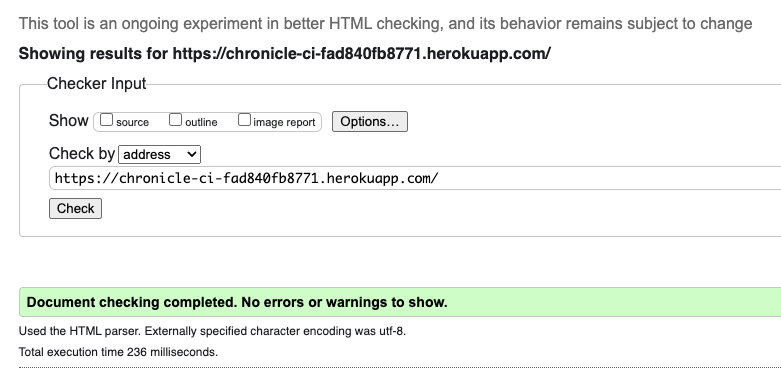
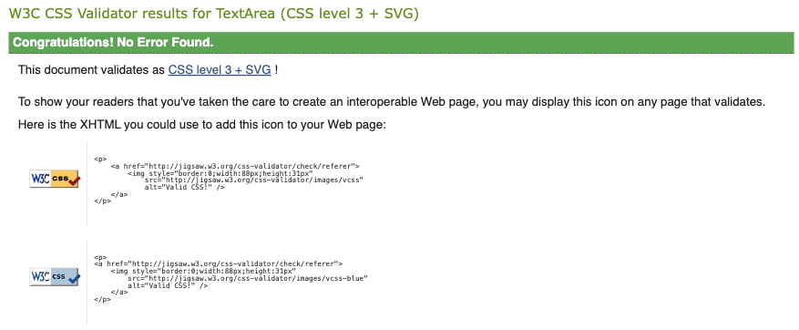

<h1 align="center">Chronicle - Testing</h1>

This is the Testing file for the [Chronicle](https://chronicle-ci-fad840fb8771.herokuapp.com/)

Return back to the [README.md](README.md)

# Validation

The codebase for the Chronicle app was thoroughly validated to ensure adherence to best practices, readability, and error-free functionality. Various tools were employed to check HTML, CSS, JavaScript code for any issues or violations.

Below is an overview of the validation processes:

## HTML Validation

- **Tool Used**: [HTML W3C Markup Validator](https://validator.w3.org/)
- **Purpose**: To ensure that all HTML code follows proper syntax and semantic structure, avoiding errors that may impact functionality or accessibility.
- **Process**: The HTML files were uploaded to the W3C Validator, and URLs of rendered pages were tested directly to identify any issues.
- **Results**: No errors or warnings in **index.html**

    

## CSS Validation

- **Tool Used**: [W3C CSS Validation Service](https://validator.w3.org/)
- **Purpose**: Ensures the CSS code is compliant with W3C standards, free from syntax errors, and follows best practices for styling.
- **Process** All CSS files are validated through the W3C CSS Validation Service to identify and rectify any issues.

- **Results**:
    All modules.css files were validated successfully with no errors or warnings. However, the warnings encountered were in **index.css** and **App.module.css** files, which are detailed below.

    

**CSS Warnings**: 
This project includes custom styles that make use of vendor-specific extensions and pseudo-elements to ensure a consistent and polished user experience across various browsers and operating systems. During the linting process, certain warnings may appear, indicating the use of these vendor-specific extensions. These warnings are expected and can be safely ignored.

The following vendor-specific extensions and pseudo-elements are used in the project:

1. Font and Font Smoothing:

    - `-apple-system,BlinkMacSystemFont,'Segoe UI','Roboto','Oxygen','Ubuntu','Cantarell','Fira Sans','Droid Sans','Helvetica Neue',sans-serif`
    - `-webkit-font-smoothing`
    - `-moz-osx-font-smoothing`

2. Custom Scrollbar Styles for WebKit Browsers:

    - `::-webkit-scrollbar`
    - `::-webkit-scrollbar-track`
    - `::-webkit-scrollbar-thumb`

These styles are essential for ensuring optimal font rendering and custom scrollbar appearance, particularly in WebKit-based browsers (such as Chrome and Safari).

## JavaScript Validation