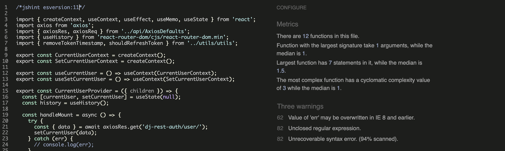
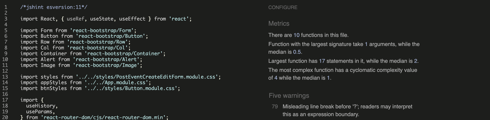
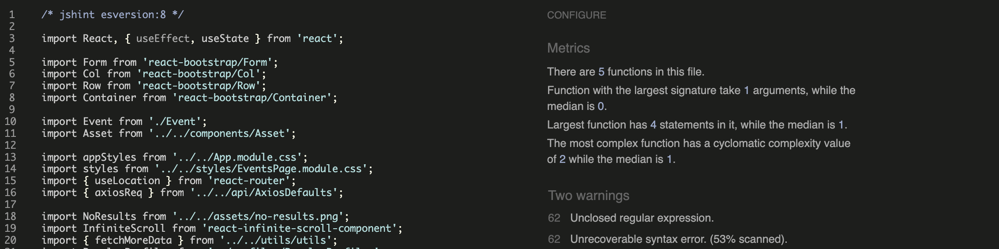
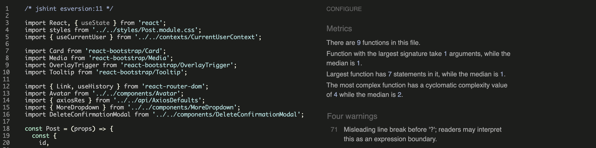

<h1 align="center">Chronicle - Testing</h1>

This is the Testing file for the [Chronicle](https://chronicle-ci-fad840fb8771.herokuapp.com/)

Return back to the [README.md](README.md)

# Manual Testing

Key features were tested across devices and browsers for functionality, responsiveness, and error handling. Real-world scenarios were simulated to ensure smooth performance.

### User Authentication 

| Test Case | Expected outcome | Results |
|-----------|------------------|---------|
| Sign Up - existing username | Display an appropriate error message. | ✅ |
| Sign Up - password violates rules	 | Display clear feedback on password requirements. | ✅ |
| Sign Up - valid sign up	 | User is registered in the database and redirected to the Sign In page. | ✅ |
| Sign In - Wrong Credentials |	Display an error message for invalid credentials. | ✅ |
| Sign In - Correct Credentials | User is authenticated and redirected to the Home page.	| ✅ |
| Sign Out | User is successfully signed out and redirected to the Home page. | ✅ |

### Navigation

| Test Case | Expected outcome | Results |
|-----------|------------------|---------|
| Logo - Click on the logo | Redirects the user to the Home page. | ✅ |
| Links - Click on links | Redirects to the correct page. | ✅ |
| Clicking on a post or event's image redirects to detail | Clicking on a post or event's image redirects the user to the detailed view page of that content. | ✅ |
| User-specific links appear when logged in | When logged in, the user sees extra links in the navbar related to their account. | ✅ |

### Content Display 

| Test Case | Expected outcome | Results |
|-----------|------------------|---------|
| Loading spinner | A loading spinner appears when the page is loading data. | ✅ |
| Content list display | A list of posts or events is displayed after the data is loaded. | ✅ |
| Search functionality | The content list is filtered according to the search query. | ✅ |
| Clicking on image | Clicking on a post or event's image redirects to the detail view of that content. | ✅ |

### User-Specific Content

| Test Case | Expected outcome | Results |
|-----------|------------------|---------|
| My Feed | In the 'My Feed' page, only posts from users the current user follows appear. | ✅ |
| My Likes | Posts liked by the user appear in the 'My Likes' page. | ✅ |
| My Events | If the user marks attendance or shows interest in an event, the event appears in 'My Events'. | ✅ |
| Profile page | The profile page displays the user's created posts, events, and statistics (followers, following, posts & events count). | ✅ |
| Notifciation Page | Shows notifications for likes, comments, follows, and RSVP actions related to the user with working links | ✅ |

### User Interactivity

| Test Case | Expected outcome | Results |
|-----------|------------------|---------|
| Like a post | Clicking the heart icon on a post increases the likes count and adds it to 'My Likes'. | ✅ |
| Comment on a post | The user can add a comment on a post in its detailed view. | ✅ |
| Edit a post comment | Comment content changes are reflected in database. | ✅ |
| Delete a post comment | Comment deleted from the database. | ✅ |
| Mark RSVP on events | The user can mark 'interested' or 'attending' by click on the buttons. and count increases and appears in my events | ✅ |
| Follow/unfollow users| Clicking the follow/unfollow button on a user's profile correctly follows or unfollows them. | ✅ |
| Following & Followers count| Profile updates following and followers count | ✅ |
| Post related notifications | User recieves notifications when another user likes or comments on their post. | ✅ |
| Event related notifications | User recieves notifications when another user marks RSVP on their event. | ✅ |
| Follow related notifications | User recieves notifications when someone follows them. | ✅ |

### Content Management

| Test Case | Expected outcome | Results |
|-----------|------------------|---------|
| Create a new post | New post created in database. | ✅ |
| Create a new event | New event created in database. | ✅ |
| Edit a post | The form is prefilled with the current data. The changes are reflected in the database | ✅ |
| Edit an event | The form is prefilled with the current data. The changes are reflected in the database | ✅ |
| Delete a post | Post is deleted from the database | ✅ |
| Delete an event | Event is deleted from the database | ✅ |

 

# Validation

The codebase for the Chronicle app was thoroughly validated to ensure adherence to best practices, readability, and error-free functionality. Various tools were employed to check HTML, CSS, JavaScript code for any issues or violations.

Below is an overview of the validation processes:

## HTML Validation

- **Tool Used**: [HTML W3C Markup Validator](https://validator.w3.org/)
- **Purpose**: To ensure that all HTML code follows proper syntax and semantic structure, avoiding errors that may impact functionality or accessibility.
- **Process**: The HTML files were uploaded to the W3C Validator, and URLs of rendered pages were tested directly to identify any issues.
- **Results**: No errors or warnings in **index.html**

    

## CSS Validation

- **Tool Used**: [W3C CSS Validation Service](https://validator.w3.org/)
- **Purpose**: Ensures the CSS code is compliant with W3C standards, free from syntax errors, and follows best practices for styling.
- **Process** All CSS files are validated through the W3C CSS Validation Service to identify and rectify any issues.

- **Results**:
    All modules.css files were validated successfully with no errors or warnings. However, the warnings encountered were in **index.css** and **App.module.css** files, which are detailed below.

    

**CSS Warnings**: 
This project includes custom styles that make use of vendor-specific extensions and pseudo-elements to ensure a consistent and polished user experience across various browsers and operating systems. During the linting process, certain warnings may appear, indicating the use of these vendor-specific extensions. These warnings are expected and can be safely ignored.

The following vendor-specific extensions and pseudo-elements are used in the project:

1. Font and Font Smoothing:

    - `-apple-system,BlinkMacSystemFont,'Segoe UI','Roboto','Oxygen','Ubuntu','Cantarell','Fira Sans','Droid Sans','Helvetica Neue',sans-serif`
    - `-webkit-font-smoothing`
    - `-moz-osx-font-smoothing`

2. Custom Scrollbar Styles for WebKit Browsers:

    - `::-webkit-scrollbar`
    - `::-webkit-scrollbar-track`
    - `::-webkit-scrollbar-thumb`

These styles are essential for ensuring optimal font rendering and custom scrollbar appearance, particularly in WebKit-based browsers (such as Chrome and Safari).

## JavaScript Validation

Initially, I attempted to use ESLint to validate and enforce code quality in my project. However, I encountered persistent compatibility issues between ESLint and other dependencies in my app. Despite multiple attempts to resolve these issues, including upgrading and reconfiguring dependencies, the conflicts made it impossible to run the project effectively.

To address this, I followed these steps:

1. **Formatted Code with Prettier:**

- Before removing ESLint and Prettier, I formatted my code using Prettier to ensure consistency and readability across all files.

2. **Removed ESLint and Prettier:**

- I uninstalled ESLint, Prettier, and all associated plugins and configurations to resolve the compatibility issues and allow the project to run without errors.

3. **Validated Code with an External JavaScript Validation Tool:**

- After removing these tools, I used an external [JS validation](https://jshint.com/) tool to ensure the implemented code was valid and free of critical errors.
- The validation results showed some warnings due to the usage of modern ES6+ syntax, which the validator flagged as incompatible with older JavaScript versions.

4. **Handling Warnings:**

- To address these warnings, I specified the appropriate ECMAScript version for each file using:
    - /*jshint esversion: 6 */ for ES6 code.
    - /*jshint esversion: 8 */ or /*jshint esversion: 11 */ for newer ECMAScript features used in specific files.

- This ensured the validation tool recognized the modern syntax and helped eliminate unnecessary warnings.

5. **Validation Results:**

Each folder of the project includes the corresponding validation results, documenting the checks performed and any warnings resolved using the above method.

1. **API**

- AxiosDefaults.js

1. **Components**

- #### Asset.js

- #### Avatar.js

- #### DeleteConfirmatonMoadal.js

- #### MoreDropdown.js

- #### NavBar.js

- #### NotFound.js

3. **Contexts**

- #### CurrentUserContext.js

- #### ProfileDataContext.js

4. **Hooks**

- #### useClickOutsideToggle.js

- #### useRedirect.js

5. **Mocks**

- #### handlers.js

6. **Pages**

- #### auth/SignInForm.js

- #### auth/SignUpForm.js

- #### comments/Comment.js

- #### comments/CommentCreateForm.js

- #### comments/CommentEditForm.js

- #### events/Event.js

- #### events/EventCreateForm.js

- #### events/EventEditForm.js

- #### events/EventPage.js

- #### events/EventsPage.js

- #### notifications/Notification.js

- #### notifications/NotificationsPage.js

- #### posts/Post.js

- #### posts/PostCreateForm.js

- #### posts/PostEditForm.js

- #### posts/PostPage.js

- #### posts/PostsPage.js

- #### profiles/PopularProfiles.js

- #### profiles/Profile.js

- #### profiles/ProfileEditForm.js

- #### profiles/ProfilePage.js

- #### profiles/UsernameForm.js

- #### profiles/UserPasswordform.js

- #### utils/utils.js

- #### App.js

- #### index.js

